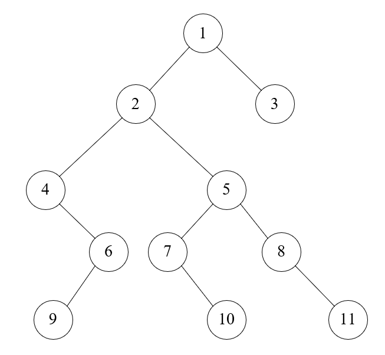

# LeetCodeTools

---

## en-US

This reposity contains tools for debugging and other useages for LeetCode. 

Language: C++17  

Support MSVC 19.3 (`cl /std:c++17`), GCC-10 (`g++ -std=c++17`), clang-12 (`clang++ -std=c++17`).  

**Note: All APIs are in the `leetcode` namespace.** 

### build_tree

This project intends to transform the array used to represent a binary tree as the input of LeetCode to a actual binary tree. For example, if the input is `[1,2,null,3,4,null,5,6,7,8,null,null,9,null,10]`,  then the output will be a binary tree below:  

To use `build_tree`，you should include the header `build_tree.hpp`.  

[Click here](./docs/build_tree/en-US.md) to view APIs.  

## zh-CN

本仓库包含为力扣定制的调试工具以及其他工具。  

语言：C++17  

支持 MSVC 19.3 (`cl /std:c++17`), GCC-10 (`g++ -std=c++17`), clang-12 (`clang++ -std=c++17`)。  

**注意：所有接口都封装在 `leetcode` 命名空间内**。  

### build_tree

本项目致力于将力扣题目中作为输入的代表二叉树的数组转换为真正的二叉树。例如，如果输入为 `[1,2,null,3,4,null,5,6,7,8,null,null,9,null,10]`，则输出为下面的二叉树：  

如果要使用本功能，则需要包含头文件 `build_tree.hpp`。  

[点击此处](./docs/build_tree/zh-CN.md)查看接口。  

